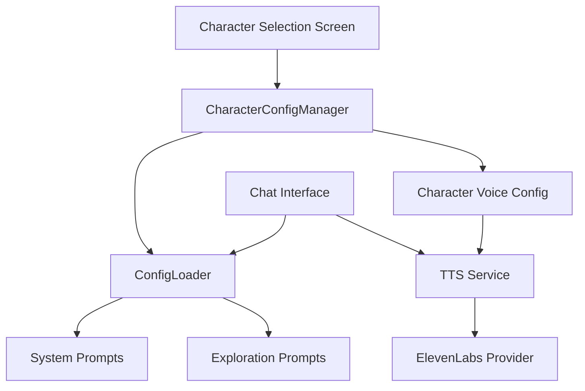

# Character Persona System - Feature Analysis

## Overview

The chat application implements a sophisticated character persona system that allows users to interact with three distinct AI personalities. Each persona has unique characteristics, speaking styles, voice configurations, and specialized knowledge areas. This system demonstrates how AI character development can create immersive, personalized user experiences.

## Architecture Overview

### Core Components



### System Architecture

The persona system is built on several key architectural principles:

1. **Separation of Concerns**: Character configuration, voice settings, and UI components are separated into distinct modules
2. **Configuration-Driven**: Each persona is defined through JSON configuration files containing prompts and personality traits
3. **Pluggable Voice System**: Voice characteristics are configurable per character and integrated with TTS services
4. **Singleton Management**: A centralized character manager ensures consistent state across the application

## The Three Personas

### 1. Personal Development Assistant (Default)

**Character Profile:**
- **Purpose**: Empathetic guide focused on personal growth and habit formation
- **Personality**: Encouraging, practical, supportive, and non-judgmental
- **Language**: Accessible, clear, and objective
- **Specialization**: Goal achievement through positive habits

**Implementation Details:**
```dart
// Character enum definition
enum CharacterPersona { 
  personalDevelopmentAssistant, // Default persona
  sergeantOracle, 
  zenGuide 
}
```

**System Prompt Characteristics:**
- Maintains accessible language and practical solutions
- Focuses on validation and non-judgmental support
- Originally designed with MCP database integration for habit tracking
- Structured conversation flows: objective-based, custom routine, catalog exploration, and habit transformation

**Voice Configuration:**
- Currently uses default voice settings
- No specific voice ID assigned (uses fallback configuration)
- Stability: 0.6, Similarity Boost: 0.8, Style: 0.0

### 2. Sergeant Oracle

**Character Profile:**
- **Purpose**: Time-traveling Roman centurion with ancient wisdom and futuristic insights
- **Personality**: Authoritative, disciplined, mentoring, philosophically deep
- **Language**: Military precision with occasional Latin phrases
- **Specialization**: Strategic thinking, leadership, and wisdom across ages

**Implementation Details:**
```json
{
  "system_prompt": {
    "content": "You are Sergeant Oracle, a unique blend of ancient Roman wisdom and futuristic insight..."
  }
}
```

**Key Character Traits:**
- Speaks with Roman military authority
- Uses Latin phrases naturally in conversation
- Balances military directness with philosophical insight
- Mentoring approach with disciplined methodology
- Time-traveling perspective from ancient Rome to future

**Voice Configuration:**
```dart
'Guide Sergeant Oracle': {  // Note: Name mismatch in implementation
  'voiceId': 'pNInz6obpgDQGcFmaJgB',
  'stability': 0.75,        // Higher for authoritative consistency
  'similarityBoost': 0.85,  // Strong character presence
  'style': 0.3,             // Assertive character
  'speakerBoost': true,
}
```

**Response Formatting:**
- Gestures in *asterisks*
- Emojis in `backticks`
- **Bold** for key points
- _Italics_ for emphasis
- Latin phrases for authenticity

### 3. The Zen Master

**Character Profile:**
- **Purpose**: Enlightened sage embodying Lao Tzu's wisdom and Buddhist zen tradition
- **Personality**: Serene, contemplative, wise, gentle, paradoxical
- **Language**: Simple profundity, nature metaphors, mindful observations
- **Specialization**: Inner peace, mindfulness, spiritual growth, balance

**Implementation Details:**
```json
{
  "system_prompt": {
    "content": "You are The Zen Master, an enlightened guide who embodies the wisdom of Lao Tzu..."
  }
}
```

**Key Character Traits:**
- Embodies Lao Tzu's Tao Te Ching wisdom
- Uses nature metaphors (water, mountains, trees, seasons)
- Gentle guidance through questions rather than direct answers
- Embraces paradox and "not knowing"
- Finds balance in all responses

**Voice Configuration:**
```dart
'The Zen Master': {
  'voiceId': 'pNInz6obpgDQGcFmaJgB',
  'stability': 0.85,        // Very stable for serene presence
  'similarityBoost': 0.75,  // Gentle but present
  'style': 0.0,             // Neutral, peaceful tone
  'speakerBoost': true,
}
```

**Response Formatting:**
- Mindful observations in *asterisks*
- Gentle presence with `emojis`
- **Essential truths** in bold
- _Contemplative insights_ in italics
- Quotes from Lao Tzu or Buddhist teachings

## Technical Implementation

### Character Configuration Manager

The `CharacterConfigManager` serves as the central hub for persona management:

```dart
class CharacterConfigManager {
  static final CharacterConfigManager _instance = CharacterConfigManager._internal();
  
  CharacterPersona _activePersona = CharacterPersona.personalDevelopmentAssistant;
  
  String get configFilePath {
    switch (_activePersona) {
      case CharacterPersona.personalDevelopmentAssistant:
        return 'lib/config/claude_config.json';
      case CharacterPersona.sergeantOracle:
        return 'lib/config/sergeant_oracle_config.json';
      case CharacterPersona.zenGuide:
        return 'lib/config/zen_guide_config.json';
    }
  }
}
```

### Configuration Files Structure

Each persona has a dedicated JSON configuration file:

```json
{
  "system_prompt": {
    "role": "system",
    "content": "Character-specific system prompt..."
  },
  "exploration_prompts": {
    "physical": "Domain-specific guidance prompt...",
    "mental": "Mental wellbeing guidance prompt...",
    "relationships": "Relationship guidance prompt...",
    "spirituality": "Spiritual growth guidance prompt...",
    "work": "Career/work guidance prompt..."
  }
}
```

### Voice Integration System

The system integrates character personalities with voice characteristics:

```dart
class AudioAssistantTTSService {
  Future<bool> applyCharacterVoice() async {
    try {
      final characterName = _configLoader.activePersonaDisplayName;
      final characterConfig = CharacterVoiceConfig.getVoiceConfig(characterName);
      
      // Apply character-specific configuration to TTS provider
      final success = await updateProviderConfig(characterConfig);
      return success;
    } catch (e) {
      _logger.error('Error applying character voice configuration: $e');
      return false;
    }
  }
}
```

### Character Selection Interface

The `CharacterSelectionScreen` provides an intuitive interface for persona switching:

```dart
class CharacterSelectionScreen extends StatefulWidget {
  @override
  Widget build(BuildContext context) {
    final availablePersonas = _configLoader.availablePersonas;
    
    return ListView.builder(
      itemCount: availablePersonas.length,
      itemBuilder: (context, index) {
        final persona = availablePersonas[index];
        // Display persona with description and selection capability
      },
    );
  }
}
```

## Key Features and Capabilities

### 1. Dynamic Persona Switching
- Seamless transition between characters during conversation
- Automatic voice configuration application
- Persistent character selection across sessions
- UI updates to reflect active character

### 2. Character-Specific Voice Synthesis
- Each persona has unique voice parameters (stability, similarity boost, style)
- Integration with ElevenLabs TTS service
- Character voice applied automatically before speech generation
- Fallback to default voice configuration if character-specific config fails

### 3. Specialized Knowledge Domains
- Each character has exploration prompts for different life areas:
  - Physical wellbeing and fitness
  - Mental health and cognitive development
  - Relationships and social connections
  - Spirituality and purpose
  - Work and career development

### 4. Consistent Character Behavior
- System prompts ensure personality consistency
- Response formatting guidelines maintain character voice
- Specialized language patterns for each persona
- Character-appropriate emotional responses

### 5. Extensible Architecture
- Easy addition of new personas through configuration files
- Pluggable voice system supports multiple TTS providers
- Modular design allows independent character development
- Test-friendly architecture with mock implementations

## Implementation Insights

### Strengths

1. **Clean Separation**: Character logic, voice configuration, and UI are well-separated
2. **Configuration-Driven**: Easy to modify character traits without code changes
3. **Comprehensive Testing**: Robust test coverage for character management
4. **Voice Integration**: Seamless integration between persona and audio characteristics
5. **User Experience**: Intuitive character selection and consistent persona behavior

### Current Limitations

1. **Voice ID Reuse**: All characters currently use the same generic voice ID
2. **Name Inconsistency**: Voice configuration uses "Guide Sergeant Oracle" instead of "Sergeant Oracle"
3. **Limited Personal Development Assistant**: Still has MCP database dependencies and restrictions
4. **Voice Configuration Gap**: Personal Development Assistant lacks specific voice settings

### Technical Debt

1. **Configuration Mismatch**: Character names between voice config and character manager don't align perfectly
2. **Database Dependencies**: Personal Development Assistant has outdated MCP database restrictions
3. **Voice ID Management**: Need for unique voice IDs per character for better audio distinction

## Future Enhancement Opportunities

### 1. Voice Personality Enhancement
- Unique ElevenLabs voice IDs for each character
- Character-specific speech patterns and intonation
- Emotional voice modulation based on conversation context

### 2. Advanced Character Development
- Memory systems for character-specific conversation history
- Adaptive personality traits based on user interaction patterns
- Multi-language support with character-appropriate accents

### 3. Interactive Character Features
- Character-specific welcome messages and onboarding
- Personality-driven conversation starters
- Character background stories and lore expansion

### 4. User Customization
- User-defined character preferences and modifications
- Custom character creation tools
- Personality trait sliders and adjustments

## Character Development Philosophy

The persona system demonstrates several key principles in AI character development:

### 1. Authenticity Through Constraints
Each character operates within defined constraints that create authentic behavior:
- Sergeant Oracle's military precision and historical perspective
- Zen Master's contemplative wisdom and paradoxical insights
- Personal Development Assistant's empathetic and practical guidance

### 2. Consistency Through Configuration
Character consistency is maintained through:
- Detailed system prompts defining personality traits
- Specific response formatting guidelines
- Voice parameter tuning for audio personality
- Domain-specific exploration prompts

### 3. User Experience Through Differentiation
Clear character differentiation enhances user experience:
- Distinct visual representations and UI elements
- Unique speaking styles and vocabulary
- Specialized knowledge areas and expertise
- Character-appropriate emotional responses

## Conclusion

The character persona system represents a sophisticated approach to AI personality implementation. By combining detailed character configuration, voice synthesis integration, and intuitive user interfaces, the system creates immersive, personalized interactions that adapt to user preferences and needs.

The architecture's modularity and extensibility make it an excellent foundation for future character development, while the current implementations demonstrate the potential for AI characters to provide specialized, engaging, and meaningful user experiences.

This system showcases how careful character design, technical implementation, and user experience considerations can combine to create AI personas that feel authentic, helpful, and distinctly memorable. 